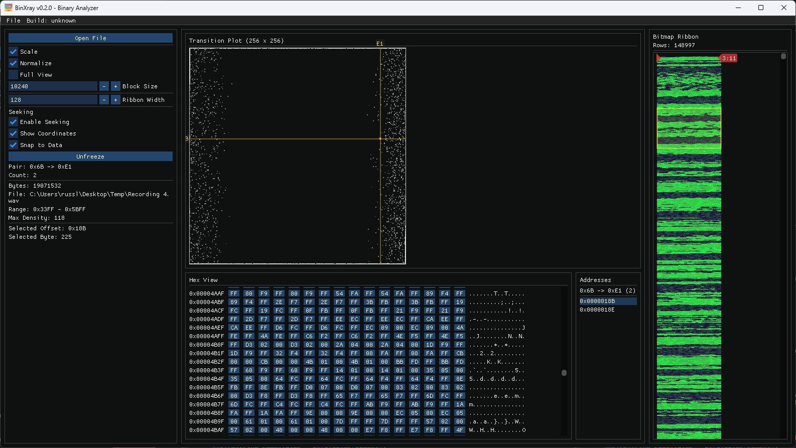

<!-- SPDX-License-Identifier: MIT -->
# Bin X-ray

**Bin X-ray** is the C++ successor of the original **[BinView](https://github.com/russlank/BinView)** utility, focused on fast interactive binary inspection with an ImGui desktop UI.

At its core, the tool renders a **byte-pair scatterplot** — a 256×256 matrix where each cell `(x, y)` represents how often byte value `x` is immediately followed by byte value `y` in the file. This fingerprint reveals structure, repetition, compression, and entropy at a glance. In windowed mode the matrix becomes a **sliding byte-pair plot**, updating in real time as you scrub through the file via the bitmap ribbon overview, letting you watch structural patterns shift across the binary.

## Screenshots

## Current Phase

Phase 2 parity core is now implemented:

- Async `Open File` flow for large binaries.
- Legacy-compatible byte-pair scatterplot engine (`P[256][256]`) with `Scale`, `Normalize`, `Full View`, and `Block Size` controls.
- **Sliding byte-pair plot**: scrub the bitmap ribbon to slide the analysis window over the file and watch the scatterplot update in real time.
- **Transition seeking**: hover the scatterplot to select a byte pair, see all matching offsets in a scrollable address list, and navigate directly to each hit in the hex view.
- **Bitmap ribbon navigation**: click any pixel to jump to that byte offset; red pointer triangles and a coordinate label mark the current position.
- Three-column workspace: left controls · centre plot + hex view · right bitmap ribbon.
- Expanded automated tests for binary loading, transition-matrix formulas, and offset scanning.

## Requirements

- Windows 10/11
- Visual Studio 2022 (v143 toolset)
- Windows SDK 10.0+
- Python 3 (for version helper script)

## Quick Start

1. Open `src/BinXray.slnx` in Visual Studio.
2. Select `Debug|x64`.
3. Build the solution.
4. Run:
   - app: `src\\x64\\Debug\\BinXray.exe`
   - tests: `src\\x64\\Debug\\BinXray.Tests.exe`

Or from VS Code, use tasks:

- `Build BinXray (x64 Debug)`
- `Run BinXray (x64 Debug)`
- `Run Tests (x64 Debug)`

## Repository Layout

- `src/BinXray` application code
- `src/BinXray.Tests` test runner and tests
- `src/vendor/imgui` vendored Dear ImGui
- `.vscode` shared build/run/debug configuration
- `scripts` local build/release helper scripts
- `packaging` installer scaffolding
- `doc` project documentation
